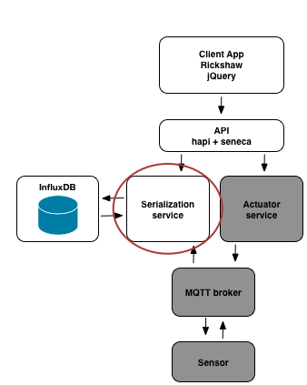

## Solution to Challenge 1

1. The container can be started with `docker run -d -p 8083:8083 -p 8086:8086 tutum/influxdb`
2. The files in _challenge2/influx/_ contain commands to start the influx container for your convenience.
3. Point your browser to [http://localhost:8083/]() to open the influx console

The `-p` argument maps ports 8083 and 8086 from the container to the host. The
`-d` argument tells docker to run the container in [detached
mode](https://docs.docker.com/engine/reference/run/#detached-d).

Note that when using docker locally, you are always dealing with a separate VM
(at least on Mac and Windows).

You can stop the container at any time by using the `docker kill` or `docker
stop` commands.


## Challenge 2


Now that we have our database running, we are going to create a microservice to
read and write to it. A serialization service has been created for you in
_challenge2/serializer_.

Your challenge is to write a small script to start this process and use it to
write temperature values into Influx DB. Once the service is up and running you
can use the following command to send data points to the service.

```sh
curl -X POST -d '{"role": "serialize", "cmd": "write", "sensorId": "1", "temperature": 32}' http://localhost:10000/act  --header "Content-Type:application/json"
```

__hint__ If you look at the code in _serializer.js_ you will notice that it uses the following environment variables:

* `INFLUX_HOST=localhost`
* `SERIALIZER_PORT=10000`

Your startup script will need to set these variables to the correct values.

You can check that the data points are indeed written to influx by pointing your
browser to the influx web interface and running this query. Make sure to select
the `temperature` database from the drop-down menu.

```
select * from temperature;
```

## Next Up: [Challenge 3](../challenge3/README.md)
