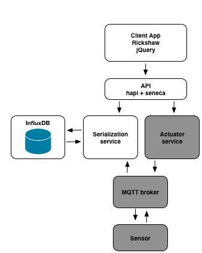

## Solution to Challenge 2

1. The influx container can be started with the scripts provided in _challenge3/influx_.  If you have the influx container created, you can run `docker start influx` to start it.
2. The folder _challenge3/serializer_ contains the code for the serialization service
3. Start this service with the script _challenge3/serializer/run.sh_ (or run.bat)
4. Send some test data using the script _challenge3/serializer/testWrite.sh_ (or testWrite.bat)
5. Use the influx console to view data points

__note__ The serializer code is a Seneca microservice. Seneca provides an
abstraction layer over various transport mechanisms including TCP, HTTP,
RabbitMQ, Redis, NATS, etc... In this tutorial we are using HTTP as the
transport mechanism and sending JSON based messages.

## Challenge 3

The next thing we will need to do is to hook up our frontend to our
serialization service in order to read data values for charting.

An updated frontend that talks to the serialization service is provided in
_challenge3/frontend_.

Your challenge is to start up InfluxDB, the frontend, and the serialization
service. To do this you will need to write a startup script for the frontend
service in the same way as the serialization service.

Once you have these up and running use the _testWrite.sh_ script to send data to
the serialization service and see it appear in the front end.

__hint__ If you look at the updated frontend code you will see that it uses the
following environment variables:

* `SERIALIZER_HOST`
* `SERIALIZER_PORT`
* `FRONTEND_PORT`

Your script will need to set these values prior to starting the frontend.

## Next Up: [Challenge 4](../challenge4/README.md)
